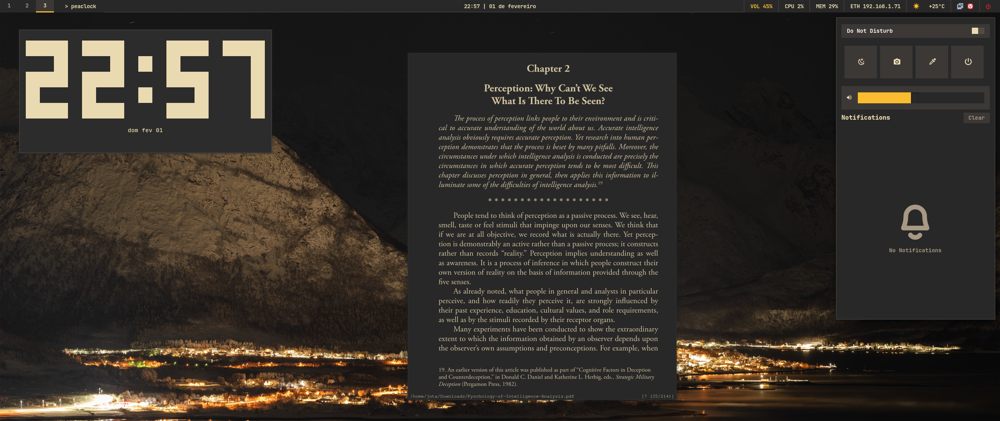

# My Dotfiles



This repository contains my personal configuration files (dotfiles) for my arch and hyprland setup. I haven't really tested this so idk, i just want to save my dotfiles somewhere.

## Structure

- `.config/` - Contains configuration directories for various applications.
- `install.sh` - Automated installation script.

## included Configurations

- **Hyprland**: Window manager config.
- **Waybar**: Status bar config.
- **SwayNC**: Notification center config.
- **Kitty**: Terminal emulator config.
- **Rofi/Wofi**: Application launcher config.
- **Scripts**: Custom scripts.
- **Neovim**: Neovim.
- **Waypaper**: Wallpaper manager config.
- **SwayOSD**: On-screen display for volume/brightness.

Using this you can browse, screenshot, read and code. It doesn't get better than this.

## Installation

To install these dotfiles on a new system or restore them:

1.  Clone this repository (or ensure it's in the desired location).
2.  Make the install script executable:
    ```bash
    chmod +x install.sh
    ```
3.  Run the install script:
    ```bash
    ./install.sh
    ```
