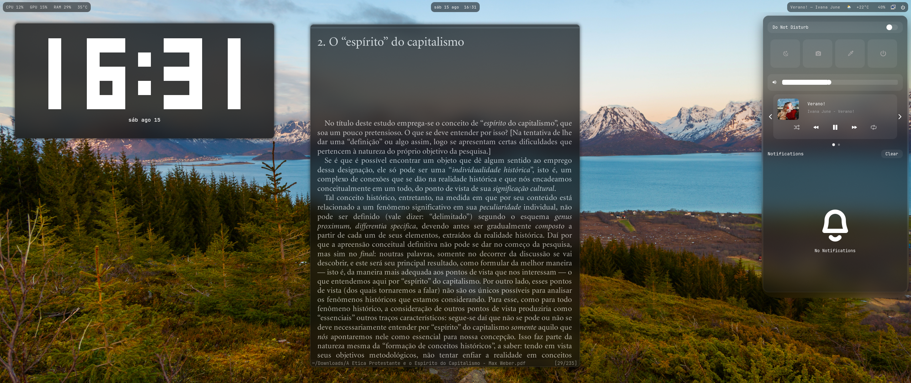

# My Dotfiles



Personal Arch + Hyprland setup. Monochrome and translucent: dark glass surfaces,
white-on-gray monospace, no accent color anywhere except one red for things that
are actually wrong. See [`.config/PALETTE.md`](.config/PALETTE.md) for the exact
values and the one deliberate exception (the terminal keeps hued ANSI colors, or
`git diff` becomes unreadable).

## Structure

- `.config/` — configuration directories for each application.
- `.config/PALETTE.md` — the color contract every config follows.
- `install.sh` — symlinks everything into place (backing up what's there) and
  optionally installs the packages.

## Included configurations

- **Hyprland** — compositor, 1px borders, blur, layer-surface slide animations.
- **Waybar** — top bar as three floating translucent pills.
- **SwayNC** — notification center and control panel.
- **SwayOSD** — volume/brightness OSD.
- **Walker** — main launcher.
- **Rofi** — clipboard history and power menu.
- **Kitty** — terminal, translucent, desaturated ANSI palette.
- **Neovim** — LazyVim-ish setup on the `zenwritten` grayscale colorscheme.
- **Zsh + Starship** — zinit plugins, monochrome fzf, two-line minimal prompt.
- **Zathura** — monochrome chrome plus recolored (dark-mode) pages.
- **Waypaper / awww** — wallpaper.
- **Toolkit themes** — this is what stops third-party apps from being the odd
  one out.
- **gsimplecal** — calendar popup, styled from `gtk-3.0/gtk.css`.

Not managed here, and still on their own palettes: btop (set to the stock
`greyscale` theme in `~/.config/btop/btop.conf`, which this repo doesn't own),
mpv, vlc, obs and the browsers.

## Keybinds worth remembering

| Keys | Action |
| --- | --- |
| `SUPER` (tap) | Walker launcher |
| `SUPER + T` / `B` / `E` | terminal / browser / files |
| `SUPER + N` | notification center |
| `SUPER + V` | clipboard history |
| `SUPER + W` | wallpaper picker |
| `SUPER + P` | cycle bar mode: normal → por baixo → oculta |
| `SUPER + L` | lock |
| `SUPER + Q` / `F` | close / fullscreen |
| `SUPER + ALT + F` | toggle float |
| `SUPER + SHIFT + S` | screenshot to clipboard |
| `SUPER + 1..0` | workspace (pops the dots) |
| `SUPER + SHIFT/ALT + 1..0` | move window there (with / without following) |
| `CTRL + ALT + DEL` | power menu |

## Installation

```bash
chmod +x install.sh
./install.sh
```

It backs up anything already at the target path as `<name>.backup_<timestamp>`
before linking.
